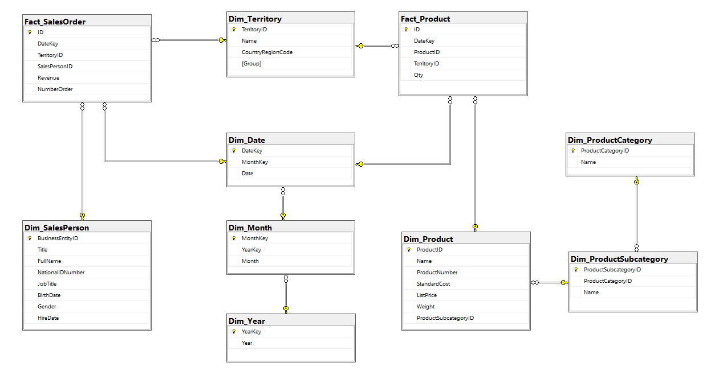
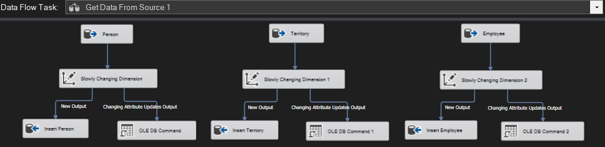
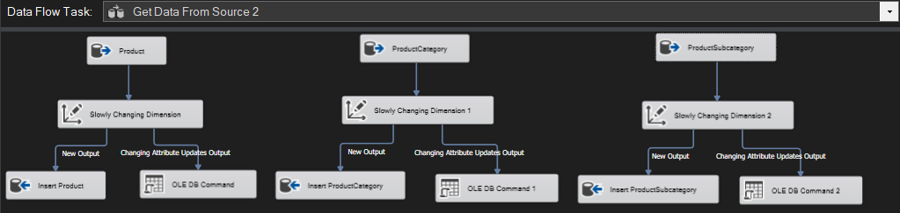
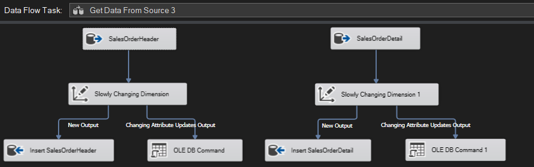

# ETL-PowerBI

## Environment

* Database source : AdventureWorks2012 https://learn.microsoft.com/en-us/sql/samples/adventureworks-install-configure?view=sql-server-ver16&tabs=ssms
* Install Visual Studio 2022
* Install Sql Server Development
* Install Integration Services Project for Visual Studio
* Install PowerBI

## Project

### I. Require
1. Report sales by each employee
2. Report sales by each territory
3. Report number of orders by employee
4. Report number of orders by territory
5. Report sales quantity by product category
6. Report sales volume by product and territory

### II. Design Data Warehouse and ETL

#### 1. Design Data Warehouse

**Choose Schema**

Snowflake

**Design Dimension and Fact tables**

- Report sales by each employee => **Employee** - **SalesOrder**
- Report sales by each territory => **Territory** - - **SalesOrder**
- Report number of orders by employee => **Employee** - **SalesOrder**
- Report number of orders by territory => **Territory** - **SalesOrder**
- Report sales quantity by product category => **Product Category** - **Product**
- Report sales volume by product and territory => **Product and Territory** - **Product**

Dimensions: **Employee, Territory, Product, Product Category, DateTime**

Facts: **SalesOrder, Product**

#### 2. ETL

**Data Flow**

**Staging**

- Load Staging from data source (AdventureWorks2012)

### III.	Create Dashboard with PowerBI